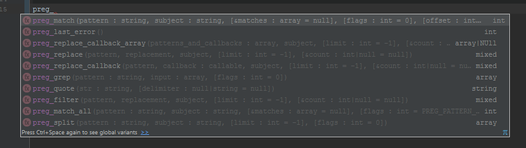
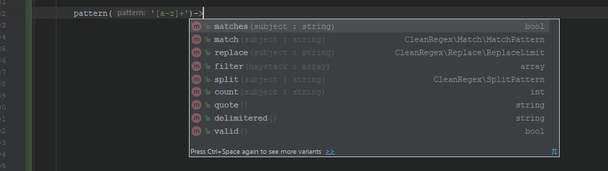

# Regular Expressions wrapper

The most advanced PHP regexp library. Clean, descriptive wrapper functions enhancing PCRE extension methods.

[](https://travis-ci.org/Danon/CleanRegex)
[](https://coveralls.io/github/Danon/CleanRegex?branch=master)

1. [Overview](#regular-expressions-wrapper)
    * [Why CleanRegex stands out?](#why-cleanregex-stands-out)
    * [What happens if you fail?](#what-happens-if-you-fail)
    * [Ways of using CleanRegex](#ways-of-using-cleanregex)
    * [What's SafeRegex?](#cleanregex-vs-saferegex)
2. [Installation](#installation)
3. [API](#api)  
    * [Matching](#matching)
    * [Retrieving](#retrieving)
    * [Iterating](#iterating)
    * [Counting](#counting)
    * [Replacing](#replace-strings)
    * [Splitting](#split-a-string)
    * [Filtering](#filter-an-array)
    * [Validating](#validate-pattern)
    * [Delimitering](#delimter-a-pattern)
    * [Other](#first-match-with-details)
4. [Why CleanRegex stands out?](#why-cleanregex-stands-out)
5. [Performance](#performance)

## Why CleanRegex stands out?

* ### Written with Clean API in mind
   * Deterministic
   * Doesn't rely on global/static state
   * No hidden behaviour or magical features
   * One method, one purpose, only
   * Descriptive, chainable interface
   * Catches all PCRE-related warnings and throws exceptions instead

* ### **No interference** with your project
   * Not messing with error handlers **in any way**.
   * Not using any global or static variables.

* ### Working **with** the developer
   * UTF8 support out of the box.
   * Many additional features that aren't provided by PHP or PCRE.
   * Automatic delimiters for your patterns.
   * Tracking offset while replacing strings.
   * Pure pattern [validation](#validate-pattern).
   * Protects against **any** PCRE error (not just `preg_last_error()`). See [Exception Tree](https://github.com/PleaseDontKillMe/pattern).
   * Each method throws separate derivation of `CleanRegexException` (`MatchPatternException`, `ReplacePatternException`, etc.), so you can try-catch multiple errors.
   * Handles all PCRE warnings, and throws exceptions instead.

* ### Cleaning the mess after PCRE
   * Fixing error with multi-byte offset.
   * Handling many ways `preg_*()` methods can fail, with graceful exceptions.

* ### Automatic delimiters for your pattern
  Surrounding slashes or tildes (`/pattern/` or  `~patttern~`) are not compulsory. CleanRegex's smart delimiter
  will conveniently add one of many delimiters for you (so to minimize the need of you escaping them), if they're not already present.

* ###  Always an exception
  `preg_match()` returns `false` if an error occurred or, if no match is found - `0` (which evaluates to `false`).  You have to do an **explicit check** in order to react to it. CleanRegex always throws an exception. 

  We got your back.

* ### No type-mixing
  Using `PCRE_CAPTURE_OFFSET` changes return types from `string` to an `array`. And there's more...

  You know these. You've been there.

[Scroll to API](#api)  

## What happens if you fail?
To check whether the pattern fails, you need to change this:
```php
if (preg_match( '/((Hello, )?World/', $word )) {
```

to this:

```php
if (($result = preg_match('/((Hello, )?World/')) === false) {
    throw new Exception();
}

if ($result) {
```
*`preg_match()`  can return `1` (match), `0` (no matches) or `false` (pattern error).*

Awful!

## Ways of using CleanRegex

There are 4 different entry points for CleanRegex and all of them work the same (No warnings, no errors, always exceptions).

```php
// Facade style
\CleanRegex\Pattern::of('[A-Z][a-z]+')->matches($subject)
```
```php
// Global method style
pattern('[A-Z][a-z]+')->matches($subject)
```
```php
use SafeRegex\preg_match;

// Old school PCRE style
preg_match('/[A-Z][a-z]+/', $subject);
```
```php
// Separate API for preg_*() methods
preg::match('/[A-Z][a-z]+/', $subject); 
```

If none of them suits you, feel free to create your own helper method :)
```php
function p(string $pattern) {
    return new \CleanRegex\Pattern($pattern);
}

p('[A-Z][a-z]+')->matches('Jhon');
```

[Scroll to API](#api)  

## CleanRegex vs SafeRegex

Only interested in catching warnings and fails, without changing your code?

```php
use SafeRegex\preg_match;

$result = preg_match('/a/', $subject'); // idential to preg_match, but never emits a warning or returns false
```
if you don't want to mix SafeRegex methods and default PCRE methods, you can casually swap `_` for `::`
```php
use SafeRegex\preg;

$result = preg::match('/a/', $subject'); // idential to preg_match, but never emits a warning or returns false
```

SafeRegex is a copy of `preg_*()` functions, but:
 * They never emit warnings
 * If an error occurred, they throw an exception
 * You don't have to check for `false` or `null` return on fail (results that suggest that the method failed)

You don't need to worry about warnings or returning false 
([or sometimes null](http://php.net/manual/en/function.preg-replace-callback-array.php)).

Regardless, of whether you use `preg_match_all()`, `SafeRegex\preg_match_all()` or `preg::match_all()`, these methods have exactly alike interfaces and paramters,
and return exactly the same data. The only exception is, that SafeRegex methods never emit warnings or return `false` 
([or sometimes null](http://php.net/manual/en/function.preg-replace-callback-array.php)), but throw an Exception on fail.

[Scroll to API](#api)  

# Installation
Simply add a composer dependency :)

```bash
composer require "pattern/clean-regex"
```

# API

## Matching

Check if subject matches the pattern:
```php
pattern('[aeiouy]')->matches('Computer');
```
```
(bool) true
```

#### Get all matches:
```php
pattern('\d+')->match('192 168 172 14')->all()
```
```
array (4) {
  0 => string '192',
  1 => string '168',
  2 => string '172',
  3 => string '14',
}
```
(without capturing groups)

## Retrieving

Get the first matched part of the string:
```php
pattern('[a-zA-Z]+')->match('Robert likes trains')->first()
```
```
(string) 'Robert'
```

## Iterating
```php
pattern('\d+')
    ->match('192 168 172 14')
    ->iterate(function (Match $match) {

        // gets the match
        $match->match()    // (string) "172"
        (string) $match    // also gets the match

        // gets the match offset 
        $match->offset()   // (int) 8
        
        // gets the match index
        $match->index()    // (int) 2

        // gets other matches
        $match->all()      // (array) [ '192', '168', '172', '14' ]
    });
```

:bulb: `Match` object contains many, many useful information. Learn more about `Match` in [Matching with details](#first-match-with-details)

:bulb: You can also use `match()->first(function (Match $m) {})` to invoke the callback only for the first match.

### Making a map

```php
pattern('\d+')
    ->match('192 168 172 14')
    ->map(function (Match $match) {
        return $match->match() * 2;
    });
```
```
array (4) {
    0 => (integer) 384,
    1 => (integer) 336,
    2 => (integer) 344,
    3 => (integer) 28,
}
```

:bulb: `Match` object contains many, many useful information. Learn more about `Match` in [Matching with details](#first-match-with-details)

## Counting

```php
$amount = pattern('[aeiouy]')->count('Computer');

echo "There are $amount vowels";
```
```
There are 3 vowels
```

You can get the same effect by calling
```php
pattern('[aeiouy]')->match('Computer')->count();
```

## Replace strings

```php
pattern('er|ab|ay|ey')->replace('P. Sherman, 42 Wallaby way, Sydney')->with('*')
```
```
(string) 'P. Sh*man, 42 Wall*y w*, Sydn*'
```

For more readability, use `replace()->callback()` to render strings with capturing groups.

### Replace using callbacks

```php
pattern('[A-Z][a-z]+')
    ->replace('Some words are Capitalized, and those will be All Caps')
    ->callback(function (Match $match) {
        return strtoupper($match);
    });
```
```
(string) 'SOME words are CAPITALIZED and those will be ALL CAPS'
```

### Replace using callbacks with groups

```php
$subject = 'Links: http://google.com and http://other.org.';

pattern('http://(?<name>[a-z]+)\.(com|org)')
    ->replace($subject)
    ->callback(function (Match $match) {
        return $match->group('name');
    });
```
```
(string) 'Links: google and other.'
```

## Split a string
Split a string:
```php
pattern(',')->split('Foo,Bar,Cat')->split();
```
```
array(3) [
    0 => (string) 'Foo', 
    1 => (string) 'Bar', 
    2 => (string) 'Cat'
]
```

Split a string, but also include a delimiter in the result:
```php
pattern('(,)')->split('One,Two,Three')->separate();
```
```
array(3) [
    0 => (string) 'One', 
    1 => (string) ',', 
    2 => (string) 'Two', 
    2 => (string) ',', 
    4 => (string) 'Three'
]
```

:bulb: Please keep in mind, that for `separate()` to return the delimiter, the delimiter must be in a capturing group
(wrapped in parentheses `(,)`). That's how `preg_split()` works, and we won't use hacks to walk-around this.

## Filter an array

```php
pattern('[A-Z][a-z]+$')->filter([
     'Mark',
     'Robert',
     'asdczx',
     'Jane',
     'Stan123'
 ])
```
```
array (3) {
    0 => (string) 'Mark',
    1 => (string) 'Robert',
    2 => (string) 'Jane',
}
```

## Validate pattern

Want to validate pattern before calling it?
```php
pattern('/[a-z]/')->valid();  // No exceptions, no warnings (no side-effects)
```
```
(bool) true
```

:bulb: Remember that `pattern()->valid()` works with you, so delimiters (`/.*/` or `#.*#`) will not be added automatically 
this time, and won't mess with your input :) so you can be sure whether the input pattern is valid or not.

```php
pattern('welcome')->valid();
```
```
(bool) false
```

## Delimter a pattern 

Want only to use our awesome delimiterer?

```php
pattern('[A-Z][a-z]')->delimitered();
```
```
/[A-Z][a-z]/
```


### Quoting
```php
echo pattern('#.*[a-z]?#')->quote();   // No exceptions, no warnings (no side-effects)
```
```bash
#\.\*\[a\-z\]\?#
```

:bulb: Remember that `pattern()->quote()` doesn't automatically delimiter the pattern (with `/.*/` or `#.*#`).

### First match with details
```php
pattern('(?<capital>[A-Z])(?<lowercase>[a-z]+)')
  ->match('Robert Likes Trains')
  ->first(function (Match $match) {

     $match->match();    // Gets the match ('Robert')
     (string) $match;    // alias for match()

     $match->subject();  // Gets the string that's being searched through ('Robert Likes Trains')

     $match->index();    // Ordinal number of the match in the string

     $match->offset();   // Gets the position of the match in the string, UTF8-safe

     $match->all();      // Gets all other matches ('Robert', 'Likes', 'Trains')

     $match->group('capital');   // Gets the value of a capturing group, by name ('R')
     $match->group(2);           // Gets the value of a capturing group, by index ('obert')

     $match->groupNames();       // Gets the names of the capturing groups (['capital', 'lowercase'])

     $match->hasGroup('capital'); // Checks whether the group was used in the pattern (true)

     $match->matched('capital');  // Checks whether the group has been matched by subject (true)

     $match->namedGroups();       // Gets all named groups with values (['capital' => 'R', 'lowercase' => 'obert'])
  });
```

# What's better


or



# Performance

#### Unnecessary calls
```php
pattern('\d+')
    ->match('192 168 172 14')
    ->iterate(function (Match $match) {})
    ->iterate(function (Match $match) {})
    ->iterate(function (Match $match) {})
    ->iterate(function (Match $match) {})
```

Clean Regex will perform only one call to `preg_match()`, and use cached results to iterate matches.
